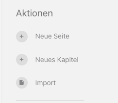
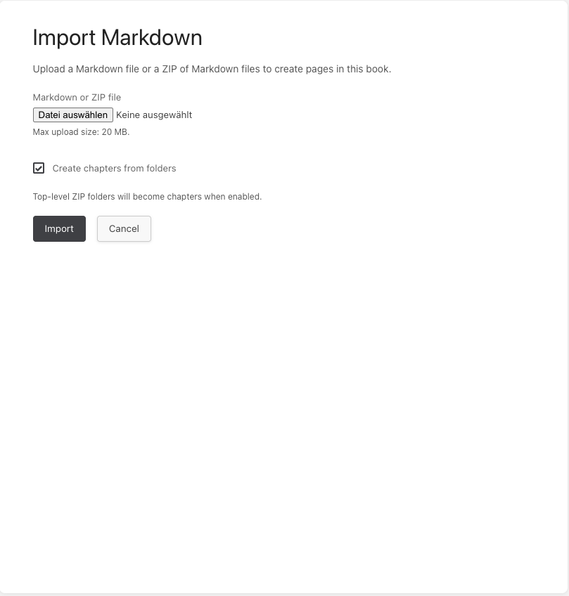

# BookStack Markdown-Importer

Importiert Markdown-, Text- und HTML-Dateien in BookStack-Buecher, inklusive ZIP-Upload mit optionaler Kapitel-Erstellung anhand der Ordnerstruktur.

## Voraussetzungen

- BookStack v23+ (Laravel 10/11/12)
- PHP 8.2+
- PHP-Erweiterungen: `zip`, `mbstring`, `dom`

## Installation

1) Paket installieren:

```bash
composer require pronomix/bookstack-markdown-importer
```

2) Service-Provider registrieren:

- Wenn Auto-Discovery aktiv ist (Standard in BookStack), ist kein Schritt noetig.
- Wenn Auto-Discovery deaktiviert ist, Provider in `config/app.php` eintragen:

```php
BookStackMarkdownImporter\ServiceProvider::class,
```

3) Konfiguration veroeffentlichen (optional):

```bash
php artisan vendor:publish --tag=bookstack-markdown-importer-config
```

4) Caches leeren:

```bash
php artisan cache:clear
php artisan view:clear
```

## Konfiguration

Datei: `config/bookstack-markdown-importer.php`

- `max_upload_mb` (int): Maximale Upload-Groesse in MB.
- `allow_zip` (bool): ZIP-Uploads mit mehreren Dateien erlauben.
- `create_chapters_from_folders_default` (bool): Standardwert fuer "Kapitel aus Ordnern erstellen".

Beispiel:

```php
return [
    'max_upload_mb' => 20,
    'allow_zip' => true,
    'create_chapters_from_folders_default' => true,
];
```

Alternativ per Umgebungsvariablen:

```
BOOKSTACK_MD_IMPORT_MAX_UPLOAD_MB=20
BOOKSTACK_MD_IMPORT_ALLOW_ZIP=true
BOOKSTACK_MD_IMPORT_CREATE_CHAPTERS_DEFAULT=true
```

## Nutzung

1) Buch in BookStack oeffnen.
2) **Import** im Buch-Aktionsmenue anklicken.
3) Eine `.md`, `.markdown`, `.txt`, `.html`, `.htm` oder eine `.zip` hochladen.
4) Optional **Kapitel aus Ordnern erstellen** fuer ZIP-Import aktivieren.
5) Import absenden; eine Zusammenfassung erscheint als Flash-Nachricht.

Screenshots:





## Verhalten im Detail

- Einzelne `.md`/`.txt`/`.html`-Datei erzeugt eine Seite im ausgewaehlten Buch.
- Mehrere Dateien koennen gleichzeitig hochgeladen werden; sie werden nacheinander verarbeitet.
- `.zip`-Uploads erzeugen mehrere Seiten in alphabetischer Pfad-Reihenfolge.
- Ordner auf oberster Ebene werden zu Kapiteln (falls aktiviert). Existiert ein Kapitel mit gleichem Namen bereits, wird es verwendet.
- Der Seitentitel ist standardmaessig der Dateiname (ohne Endung). Wenn die erste Markdown-Ueberschrift `# Titel` existiert, wird diese als Titel verwendet und aus dem Inhalt entfernt. Bei HTML wird die erste `<h1>` als Titel verwendet und entfernt.
- Bei Namenskollisionen wird numerisch erhoeht: `Meine Seite (2)`, `Meine Seite (3)` usw.

## Sicherheitshinweise

- CSRF-geschuetztes Formular und authentifizierte Routen.
- Berechtigungen: Nur Nutzer mit Buch-Bearbeitungsrecht und Seiten-Erstellrecht koennen importieren. Kapitel-Erstellung erfordert Kapitel-Erstellrecht.
- Serverseitige Validierung von Dateityp und Groesse.
- Markdown wird serverseitig mit `league/commonmark` in HTML konvertiert und mit `HTMLPurifier` bereinigt.
- ZIP-Verarbeitung nutzt PHP `ZipArchive` und sichere Pfad-Pruefungen; keine externen Binaries erforderlich.

## Deinstallation

1) Paket entfernen:

```bash
composer remove pronomix/bookstack-markdown-importer
```

2) Konfigurationsdatei loeschen (falls veroeffentlicht):

```
config/bookstack-markdown-importer.php
```

3) Caches leeren:

```bash
php artisan cache:clear
php artisan view:clear
```

## Lizenz

MIT
